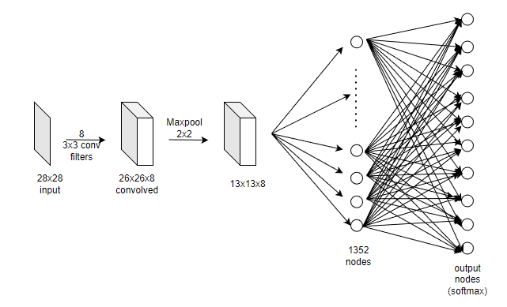
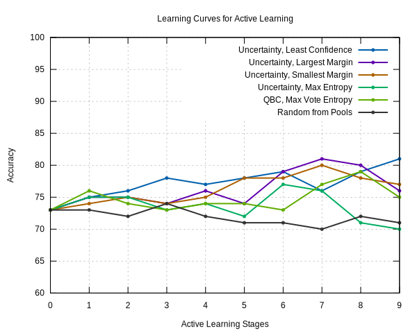
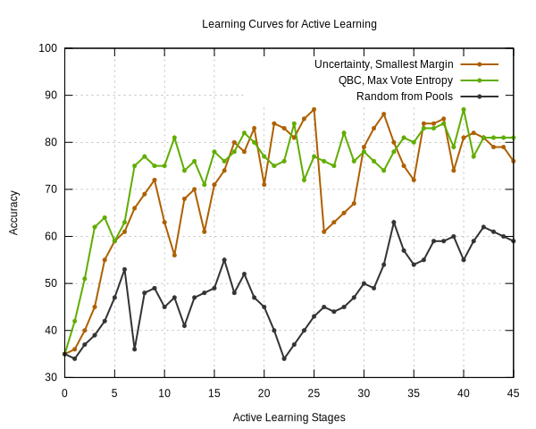
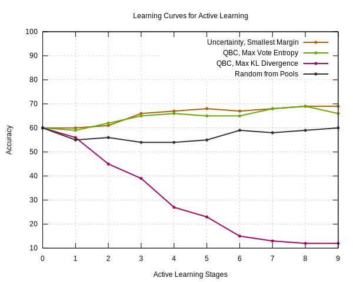
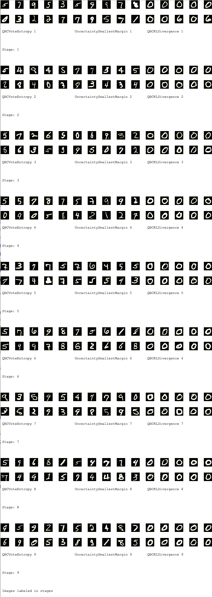

# Active Learning and using it on a CNN

- Safdar Faisal, 2022-12-11

<!-- @import "[TOC]" {cmd="toc" depthFrom=2 depthTo=6 orderedList=false} -->

<!-- code_chunk_output -->

- [Introduction](#introduction)
- [Active Learning Strategies Considered](#active-learning-strategies-considered)
  - [Uncertainty Sampling](#uncertainty-sampling)
  - [Query by committee](#query-by-committee)
- [The Dataset](#the-dataset)
- [The benchmark model](#the-benchmark-model)
- [Experiment Design](#experiment-design)
- [Results](#results)
- [Discussion](#discussion)
- [Future Prospects](#future-prospects)

<!-- /code_chunk_output -->

## Introduction

What is active learning? How does it help? Where can we use it?

Active learning refers to a group of methods in machine learning that allow a model to learn using unlabelled data that is provided during the training process. The model learns how to prioritize labelling data points based on existing labelled data. There are multiple ways in which this labelled data can be queried by the model. They include:
1.	Random Sampling: A random subset of the data is chosen for labelling
2.	Stratified Sampling: Data is divided into groups based on common characteristics. Subsets from these groups are taken
3.	Cluster Sampling: Data is divided into clusters. Subsets of clusters are taken for training
4.	Uncertainty Sampling: Data points are picked based on the least confidence metric
5.	Diversity Sampling: Data points are picked in a manner that maximises entropy
6.	Representative Sampling: Samples taken represent the overall distribution of the data
7.	Redundancy Sampling: Data points more distinct from pre-existing points will be preferred.
8.	Query by committee: Samples selected are those that provide different outputs for multiple models.

Active Learning helps to reduce the effort needed to generate labels for every datapoint in the dataset since the model itself begins to label the datapoints based on a small pool of the original dataset.

My aim when I started this project was to answer the first three questions. This was to be done by implementing different methods for active learning and testing to see if the accuracy was comparable to that seen with all the points already labelled.

## Active Learning Strategies Considered 

There are many methods when it comes to active learning algorithms. A few of which are expanded upon in this section.

### Uncertainty Sampling

**Least Confidence Method:** Here the samples that need to be labelled are selected when the model gives the lowest confidence probability for the output class. This is done over multiple Iterations/stages to generate labelled data. 

$$\hat{x} = \underset{i}{min}\left(\underset{\theta}{\mathrm{arg\,max}}\left(P(y | x \right)\right)$$

One advantage of the method of least confidence is that it is simple and easy to implement. It only requires the model to make predictions on the unlabeled samples and select the one with the lowest predicted probability for the correct class. However, it also has some limitations. For example, it may not always select the most informative samples, particularly if the model has high uncertainty or is not well-calibrated. It may also be susceptible to noise or outliers in the data. Overall, the method of least confidence can be a useful technique for uncertainty sampling in some situations, but it may not be the most effective approach in all cases.

**Smallest Margin Sample:** Smallest margin sampling is a technique for uncertainty sampling in active learning where the goal is to select samples where the model has the smallest margin of confidence in its predictions. This approach assumes that samples where the model is less confident are more likely to be informative and improve the model's performance.

$$x = \underset{x}{\mathrm{arg\,min}}\,P_\theta(y_1|x) - P_\theta(y_2|x)$$

Here, $y_1$ refers to the class with the highest confidence and $y_2$ refers to the class with the second highest confidence.

To implement smallest margin sampling, the model is first applied to the pool of unlabeled samples and the predicted probabilities for each sample are calculated. The sample with the smallest difference between the predicted probability for the correct class and the predicted probability for the next-highest class is then selected for labeling. This process is repeated until a sufficient number of samples have been labeled and the model can be updated.

**Largest Margin Sampling:** Largest margin sampling is a technique for uncertainty sampling in active learning where the goal is to select samples where the model has the largest margin of confidence in its predictions. This approach assumes that samples where the model is more confident are more likely to be informative and improve the model's performance.

To implement largest margin sampling, the model is first applied to the pool of unlabeled samples and the predicted probabilities for each sample are calculated. The sample with the largest difference between the predicted probability of the class with highest confidence and the predicted probability for the class with the lowest confidence is then selected for labeling. This process is repeated until a sufficient number of samples have been labeled and the model can be updated.

**Entropy:** Entropy sampling is a technique for uncertainty sampling in active learning where the goal is to select samples where the model has the highest uncertainty or randomness in its predictions. This approach assumes that samples where the model is more uncertain are more likely to be informative and help reduce the uncertainty.

$$\mathrm{Entropy} = \underset{i}{\sum} \left(-P_\theta(y|x)\cdot\log P_\theta(y | x)\right)$$

To implement entropy sampling, the model is first applied to the pool of unlabeled samples and the predicted probabilities for each sample are calculated. The sample with the highest entropy, which is a measure of the uncertainty or randomness in the model's predictions, is then selected for labeling. This process is repeated until a sufficient number of samples have been labeled and the model can be updated.

### Query by committee

Query by committee is a technique for selecting samples for active learning where multiple models are trained on the same data and their predictions are compared. The idea is that if multiple models make different predictions on a particular sample, it is likely to be more informative and useful for training the overall model.

To implement query by committee, the data is first divided into a training set and a pool of unlabeled samples. Multiple models are then trained on the training set. When it is time to select a new sample for labeling, the models are applied to the pool of unlabeled samples and their predictions are compared. If there is disagreement among the models (i.e. they make different predictions on the same sample), that sample is selected for labeling. This process is repeated until a sufficient number of samples have been labeled and the overall model can be updated.

**Algorithms used in QBC:**  
a) **Vote Entropy**: Vote entropy is a measure of the uncertainty or randomness in the models' predictions. It is calculated by taking the sum of the negative of the predicted probabilities for each class, multiplied by the log of the predicted probabilities. A high vote entropy indicates that the models have high uncertainty in their predictions, whereas a low vote entropy indicates that the models are more confident and consistent in their predictions.

$$x = \underset{x}{\mathrm{arg\,max}} \left(-\underset{i}{\sum}\frac{V(y_i)}{C}\log\frac{V(y_i)}{C} \right)$$

Here $V(y_i)$ refers to the number of votes the $i$th class recieves and C is the committee size.

b) **KL Divergence:** KL divergence, also known as Kullback-Leibler divergence, is a measure of the difference between two probability distributions. In the context of QBC, it is used to compare the predicted probabilities of the models for each sample. A high KL divergence indicates that the models have significantly different predicted probabilities, whereas a low KL divergence indicates that the models have similar predicted probabilities.

$$x = \underset{x}{\mathrm{arg\,max}}\left(\frac{1}{C}\sum\limits^C_{c=1}D\left(P_{\theta(c)}||P_C\right)\right)$$

Here, $c$ refers to the $c$th model within the committee and $C$ is the number of models in the committee. 

$$D\left(P_{\theta(c)}||P_C\right) = \sum\limits_i P_{\theta(c)}(y_i|x)\log\frac{P_{\theta(c)}(y_i|x)}{P_C(y_i|x)}$$

$\theta^{(c)}$ refers to a model in the committee and,  

$$P_C(y_i|x) = \frac{1}{C}\sum\limits^C_{c=1} P_{\theta(c)}(y_i|x)$$

## The Dataset
The dataset that we have decided to use is the MNIST dataset. The MNIST dataset is a set of handwritten digits of size 28x28. The dataset was taken from Kaggle. It consists of 60,000 images for the training dataset and 10,000 for the test dataset. Each image is labelled with a value between zero to nine. 

>
>
>**A set of sample images from MNIST (From Wikipedia)**

Models designed to tackle this classification problem are normally those used in image processing systems. They attempt to decipher handwritten images and convert it into digits. An extended version of MNIST known as EMNIST also provides images of uppercase and lowercase alphabets which is kept in the same 28x28 pixel format. I however keep my analysis to just the original MNIST dataset.

## The benchmark model

We plan to use [a basic CNN model](https://github.com/safdarfaisal/CNN_new) with the following components.
1.	8 convolution filters with a 3x3 kernel and a stride length of 1
2.	A 2x2 max pool layer 
3.	A single layer fully connected network
4.	Softmax activations
Upon training the model with 10000 images using just passive learning, we were able to generate an accuracy of around 85%.

## Experiment Design

1. We selected 10000 samples from the MNIST digits training dataset in random. 
2. Out of the 10000 samples, 1000 samples were randomly chosen to be the initial training set.
3. The remaining 9000 samples were considered to be the unlabeled set.
4. 100 samples were selected at random from the MNIST digit training dataset to form the test set.
5. The CNN model was trained on the 1000 images that made up the training set.
6. The CNN model was evaluated on the test set and accuracy was recorded.
7. Four additional models were required for the committee for the two QBC strategies. The same CNN model was instantiated 4 different times with different initial weights (Uniform Xavier intialization) to create these additional models.
8. The additional models were also trained on the training set.
9. The unlabeled set was divided randomly into 10 stages, each with 1000 samples. 
10. Within each stage, the sample selections strategies were applied on pools of 100 samples each, such that one sample was selected from each pool according to the selection metric for the strategy. This was done by evaluating the main and committee models against the test set and applying the selection respective strategies. This was done by evaluating. At the end of the stage, ten samples were selected.
11. For each strategy, the 10 selected samples were used to incrementaly train the main model and the committee models. The main model was evaluated against the test set and accuracy values were recorded.
12. The procedure in (9) was repeated for all 10 stages and the generated accuracy were used to plot learning curves for all strategies.
13. The entire experiment was repeated with initial training set of 200 images, with 9 stages of 200 each and 10 images taken from each stage, to evaluate the potential of active learning with minimal amount of initial training. 
14. The entire experiment in (13) was repeated with 45 stages of 200 each to identify the point at which active learning provided the same results as passive learning with a full dataset, (10000 images).

The entire framework was written from scratch in Java and GNUPlot was used for plotting.

## Results

Our major focus was on identifying good strategies to identify samples for labelling when trying to classify digits in the MNIST dataset using a CNN.

In this, we noted that some methods fared considerably better than others,  and were comparable to the passively learnt benchmark model that used 100% labelling.

1. Illustrative results from step 12

Conventional uncertainity measures like least confidence, smallest margin and largest margin consistently showed significant improvement in classification accuracy when the label count increased from 1000 to 1090 (only 90 samples labelled from 9000). QBC using max vote entropy also showed good performance compared to random selection. Uncertainity measurement using Max entropy did not provide good results consistently

The above graph illustrates the pattern, although the actual accuracy numbers for initial training and incremental active learning stages varied across multiple trials of the same experiment.  

2. Illustrative results from step 13

3. Illustrative results from step 14

4. Misbehaviour of KLdivergence strategy

QBC with max KL divergence conistently showed abnormal behaviour through multiple trials. Classification accuracy kept dropping as more selected samples were trained. When least divergent samples were selected, results were similar to that obtained for random selection. 

## Discussion

We have seen that active learning methods are very powerful tools that can be used to augment our models providing more value for significantly lower effort. Approximately, 10% improvement in accuracy was observed with 90 samples selected using active learning. The same improvement was observed only after labelling ~1500 samples with randomly selected passive learning. This represents a 94% reduction in terms of the labelling cost/effort. 

When 200 samples were provided for the initial training (step 13), the accuracy value for the best model increased from ~25% to ~65% by providing just 90 samples (a total of 290 samples). Similar accuracy was obtained with passive learning only at around 1500 samples which points to a similar reduction in cost and effort as earlier mentioned.

When we kept running the model to find the point at which it reached 80% that the model obtained using 10,000 samples on passive learning (Step 14), we found that maximum accuracy occured between 12 and 22 stages (320-420 images in total). This is consistent with our learnings from the previous experiments - a cost saving of around 95%. 

We tried to analyze the abnormal behavior of KL divergence. As can be seen in the above figure, average divergence from consensus was always higher for the digit 0 and all the 90 samples provided by active learning represented 0. This would have skewed the weights to reduce classification accuracy for other digits. The reason for higher divergence for digit 0 needs to be studied further.

## Future Prospects

There are more methods that have yet to be implemented. They include, but aren't limited to:

a) **Labelling K-means clustering:** In active learning, k-means clustering is a technique that can be used to divide the data into groups, or clusters, based on similar characteristics. This can be useful for selecting samples for labeling in active learning, as it allows the data to be divided into more homogeneous groups and makes it easier to select representative samples from each group. To use k-means clustering in active learning, the data is first divided into a training set and a pool of unlabeled samples. This model is first trained on the training set. When it is time to select new samples for labeling, the k-means algorithm is applied to the pool of unlabeled samples.  Typically the number of clusters is kept the same as the number of output classes. Each cluster represents a group of samples with similar characteristics. Representative samples from each cluster are then selected for labeling. This process is repeated until a sufficient number of samples have been labeled and the model can be updated.

The clusters might not directly correlate with the output classes and the clustering only provides a way to increase diversity amongst samples.

b) **Stream-based active learning:** Stream-based selective sampling is a type of active learning where the data is presented to the model in a continuous stream, and the model actively selects samples for labeling based on certain criteria. Stream-based selective sampling is useful in situations where the data is generated continuously and it is not feasible or desirable to store all the data in memory.

In stream-based selective sampling, the model is trained on a small batch of labeled data, and then it is applied to the incoming stream of data. As the model makes predictions on each sample, it can also select samples that are likely to be informative and useful for improving the model's performance. These samples are then labeled and added to the training set, and the model is updated accordingly. This process continues as the stream of data continues, allowing the model to continually learn and improve.

In stream-based selective sampling, samples are selected for labeling based on certain criteria that are designed to identify samples that are likely to be informative and useful for improving the model's performance. The specific criteria used to select samples will depend on the specific application and the characteristics of the data, but some common criteria include uncertainty, diversity, and density.

Uncertainty is a common criterion for selecting samples in stream-based selective sampling. This criterion assumes that samples where the model has the highest uncertainty or lowest confidence in its predictions are more likely to be informative and help reduce the uncertainty. To implement uncertainty-based sample selection, the model is applied to the stream of data and samples are selected where the model has the highest uncertainty or lowest confidence in its predictions.

Diversity is another common criterion for selecting samples in stream-based selective sampling. This criterion assumes that samples from different regions of the data space are more likely to be informative and help improve the model's performance. To implement diversity-based sample selection, the model is applied to the stream of data and samples are selected to maximize the diversity of the training set. This can be achieved by selecting samples from different clusters or by selecting samples with high distances from existing samples in the training set.

Different criteria may be more or less effective in different situations, and it may be necessary to experiment with different criteria to find the one that works best.
